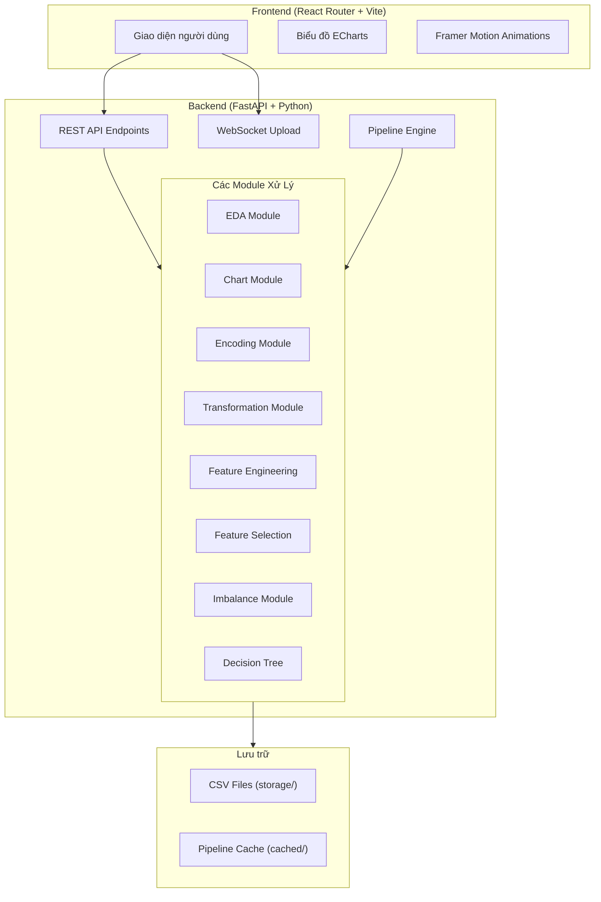
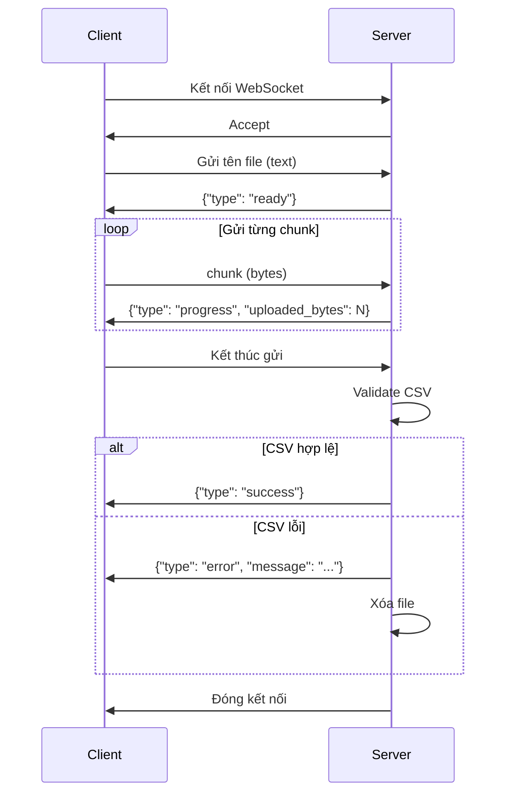
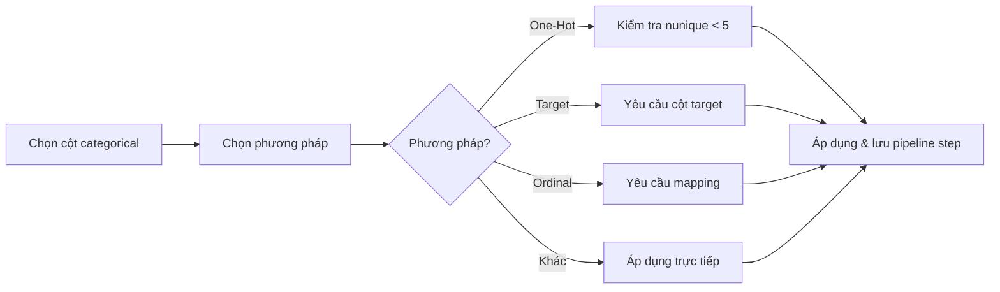
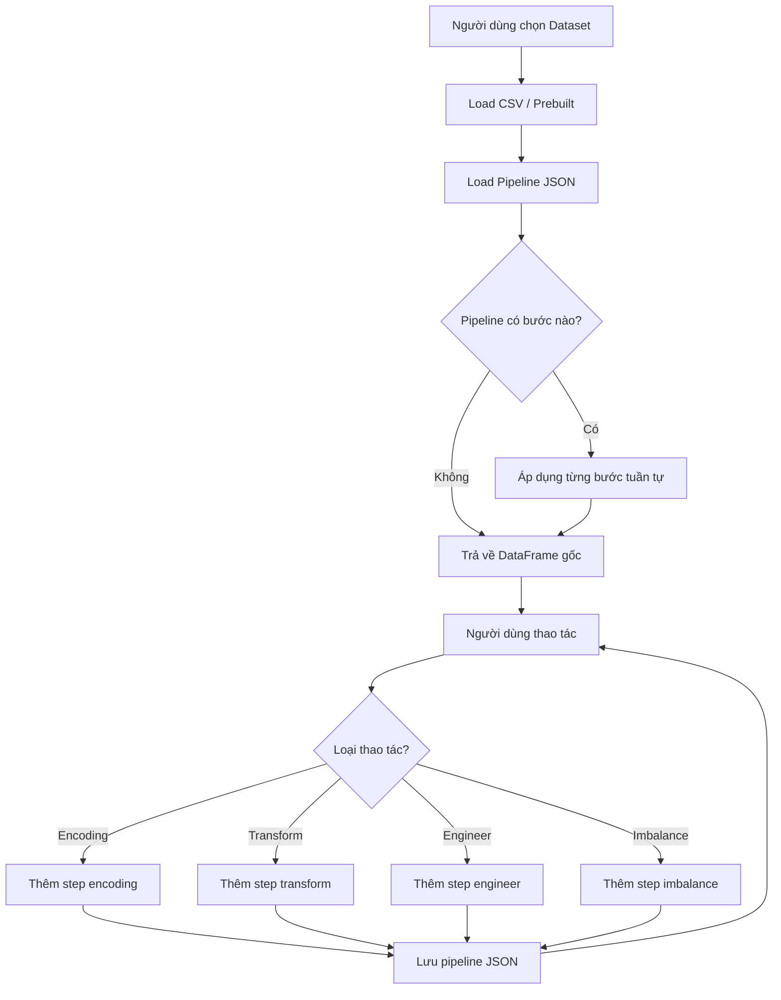
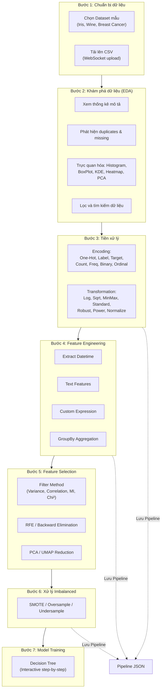

# BÁO CÁO ĐỒ ÁN
# ỨNG DỤNG TRỰC QUAN HÓA VÀ TIỀN XỬ LÝ DỮ LIỆU CHO MÔ HÌNH HỌC MÁY
**(Visualize & Preprocess Dataset For Machine Learning)**

---

## MỤC LỤC

1. [Tổng quan dự án](#1-tổng-quan-dự-án)
2. [Kiến trúc hệ thống](#2-kiến-trúc-hệ-thống)
3. [Công nghệ sử dụng](#3-công-nghệ-sử-dụng)
4. [Mô tả chi tiết các chức năng](#4-mô-tả-chi-tiết-các-chức-năng)
5. [Quy trình xử lý dữ liệu (Workflow)](#5-quy-trình-xử-lý-dữ-liệu-workflow)
6. [Thiết kế API](#6-thiết-kế-api)
7. [Lợi ích của ứng dụng](#7-lợi-ích-của-ứng-dụng)
8. [Kết luận và hướng phát triển](#8-kết-luận-và-hướng-phát-triển)

---

## 1. Tổng quan dự án

### 1.1 Đặt vấn đề

Trong quy trình xây dựng mô hình Machine Learning, **tiền xử lý dữ liệu (Data Preprocessing)** là giai đoạn quan trọng nhất, chiếm đến **60–80% thời gian** của toàn bộ dự án. Tuy nhiên, quá trình này thường:

- Yêu cầu viết code thủ công bằng Python/R, gây khó khăn cho người mới bắt đầu.
- Thiếu công cụ trực quan để hiểu dữ liệu trước khi xử lý.
- Không có cơ chế lưu lại các bước xử lý (pipeline) để tái sử dụng.
- Khó theo dõi sự thay đổi của dữ liệu sau mỗi phép biến đổi.

### 1.2 Mục tiêu

Đồ án xây dựng một **ứng dụng web** cho phép người dùng thực hiện toàn bộ quy trình tiền xử lý dữ liệu thông qua giao diện trực quan, bao gồm:

- **Tải lên và quản lý tập dữ liệu** (CSV)
- **Khám phá dữ liệu (EDA)** với các bảng thống kê và biểu đồ tương tác
- **Tiền xử lý dữ liệu** với nhiều phương pháp: mã hóa, chuẩn hóa, tạo đặc trưng mới
- **Chọn lọc đặc trưng (Feature Selection)** với các thuật toán thống kê
- **Xử lý dữ liệu mất cân bằng (Imbalanced Data)**
- **Lưu trữ quy trình (Pipeline)** để tái tạo và quản lý các bước xử lý
- **Huấn luyện mô hình Decision Tree** với trực quan hóa quá trình phân chia cây

### 1.3 Phạm vi ứng dụng

Ứng dụng hướng tới:
- Sinh viên, nghiên cứu sinh đang học về Machine Learning
- Data Analyst cần công cụ nhanh để khám phá dữ liệu
- Người dùng không chuyên muốn tiền xử lý dữ liệu mà không cần viết code

---

## 2. Kiến trúc hệ thống

### 2.1 Kiến trúc tổng thể

Ứng dụng được xây dựng theo mô hình **Client-Server (Frontend – Backend tách biệt)**, giao tiếp thông qua **RESTful API** và **WebSocket**.



### 2.2 Cấu trúc thư mục Backend

```
backend/app/
├── main.py                    # Entry point, đăng ký router
├── dependencies/              # Dependency Injection (DI) dùng chung
│   ├── dataset_action.py      # Load dataset, kiểm tra cột, áp pipeline
│   ├── math_ops.py            # Các phép toán (add, sub, mul, div, log, sin, cos,...)
│   └── cached.py              # Cache management
├── dataset_eda/               # Module Khám phá dữ liệu
├── dataset_chart/             # Module Biểu đồ
├── dataset_transfer/          # Module Upload/Download dữ liệu
├── dataset_column/            # Module Quản lý cột
├── feature_encoding/          # Module Mã hóa đặc trưng
├── feature_transformation/    # Module Biến đổi đặc trưng
├── feature_engineering/       # Module Tạo đặc trưng mới
├── feature_selection/         # Module Chọn lọc đặc trưng
├── feature_imbalance/         # Module Xử lý mất cân bằng
├── pipeline/                  # Module Pipeline
└── decision_tree/             # Module Cây quyết định
```

Mỗi module backend tuân theo kiến trúc **3 lớp**:

| Lớp | File | Vai trò |
|-----|------|---------|
| **Router** | `router.py` | Định nghĩa API endpoints, nhận request, trả response |
| **Service** | `service.py` | Chứa logic xử lý nghiệp vụ chính |
| **Schema** | `schemas.py` | Định nghĩa cấu trúc dữ liệu request/response (Pydantic models) |

### 2.3 Cấu trúc thư mục Frontend

```
frontend/app/
├── root.tsx                   # Root layout (NavigationBar + Outlet)
├── routes.ts                  # Cấu hình routing
├── api.ts                     # API client utilities (GET, POST, DELETE)
├── app.css                    # Global CSS
├── components/                # Components dùng chung
│   ├── NavigationBar.tsx      # Thanh điều hướng chính
│   ├── HeaderPreprocessing.tsx # Header cho trang tiền xử lý
│   ├── SearchBox.tsx          # Ô tìm kiếm
│   └── SystemStatus.tsx       # Hiển thị trạng thái server (RAM, Storage)
├── routes/                    # Các trang chính
│   ├── home.tsx               # Trang chủ - chọn dataset
│   ├── eda.tsx                # Trang EDA
│   ├── encodingTransform.tsx  # Trang Encoding & Transformation
│   ├── featureEngineer.tsx    # Trang Feature Engineering
│   ├── imbalance.tsx          # Trang xử lý Imbalanced Data
│   └── modelTraining.tsx      # Trang huấn luyện mô hình
├── eda/                       # Components riêng cho EDA
├── enTra/                     # Components riêng cho Encoding & Transformation
├── FeatEngin/                 # Components riêng cho Feature Engineering
├── imbalance/                 # Components riêng cho Imbalanced Data
├── modelTraining/             # Components riêng cho Model Training
├── pipeline/                  # Components cho Pipeline sidebar
└── home/                      # Components cho trang chủ
```

---

## 3. Công nghệ sử dụng

### 3.1 Backend

| Công nghệ | Phiên bản | Vai trò |
|-----------|-----------|---------|
| **Python** | ≥ 3.11 | Ngôn ngữ chính |
| **FastAPI** | ≥ 0.135.3 | Web framework, xây dựng REST API và WebSocket |
| **Pandas** | ≥ 3.0.1 | Xử lý và phân tích dữ liệu dạng DataFrame |
| **Scikit-learn** | ≥ 1.8.0 | Thuật toán ML: PCA, Scaler, RFE, Decision Tree, DBSCAN |
| **Imbalanced-learn** | ≥ 0.14.1 | Xử lý dữ liệu mất cân bằng (SMOTE, Undersampling) |
| **UMAP-learn** | ≥ 0.5.11 | Giảm chiều dữ liệu bằng UMAP |
| **TextBlob** | ≥ 0.19.0 | Phân tích cảm xúc văn bản (Sentiment Analysis) |
| **SciPy** | (dependency) | Hàm thống kê: KDE, Chi-square |
| **NumPy** | (dependency) | Tính toán số học hiệu năng cao |
| **Psutil** | ≥ 7.2.2 | Theo dõi tài nguyên server (RAM, CPU) |
| **Pydantic** | (FastAPI) | Validation dữ liệu request/response |
| **Poetry** | ≥ 2.0.0 | Quản lý dependency |

### 3.2 Frontend

| Công nghệ | Phiên bản | Vai trò |
|-----------|-----------|---------|
| **React** | ≥ 19.2.4 | UI library chính |
| **React Router** | 7.13.2 | Routing và SSR (Server-Side Rendering) |
| **TypeScript** | ≥ 5.9.3 | Ngôn ngữ strongly-typed |
| **Vite** | ≥ 7.1.7 | Build tool và dev server |
| **ECharts** | ≥ 6.0.0 | Thư viện biểu đồ tương tác |
| **Framer Motion** | ≥ 12.38.0 | Thư viện animation |
| **TailwindCSS** | ≥ 4.2.2 | CSS framework |
| **Google Fonts** | — | Typography: Inter, Manrope, Material Symbols |

### 3.3 Deployment

- **Docker**: Frontend được đóng gói bằng Dockerfile để triển khai
- **CORS**: Backend cho phép frontend truy cập từ `http://localhost:5173`

---

## 4. Mô tả chi tiết các chức năng

### 4.1 Quản lý và Tải lên Tập dữ liệu (Dataset Transfer)

#### Mô tả
Module cho phép người dùng tải lên tập dữ liệu dạng CSV lên server thông qua **WebSocket** với cơ chế truyền tải **chunk-by-chunk**, đảm bảo hiệu suất khi xử lý file lớn.

#### Chi tiết kỹ thuật
- **Giao thức**: WebSocket (`/dataset/upload`)
- **Giới hạn file**: Tối đa **50 MB**
- **Giới hạn cấu trúc**: Tối đa **100 cột** và **1.000.000 dòng**
- **Validation**: Kiểm tra CSV hợp lệ (không rỗng, không trùng tên cột, số cột đồng nhất mỗi dòng)
- **Tiến trình**: Gửi thông báo `progress` với số byte đã nhận sau mỗi chunk
- **Xử lý lỗi**: Nếu file không hợp lệ, tự động xóa file đã upload và thông báo lỗi

#### Quy trình Upload


#### Dataset có sẵn (Prebuilt)
Ứng dụng cung cấp **3 dataset mẫu** tích hợp sẵn từ Scikit-learn:

| Dataset | Mô tả | Số mẫu | Số đặc trưng | Bài toán |
|---------|--------|--------|---------------|----------|
| **Iris** | 3 loài hoa iris | 150 | 4 | Phân loại đa lớp |
| **Wine** | 3 giống rượu vang | 178 | 13 | Phân loại đa lớp |
| **Breast Cancer** | Khối u lành/ác tính | 569 | 30 | Phân loại nhị phân |

---

### 4.2 Khám phá Dữ liệu (Exploratory Data Analysis – EDA)

#### Mô tả
Module EDA cung cấp cái nhìn tổng quan về tập dữ liệu, giúp người dùng hiểu cấu trúc, phân phối, và chất lượng dữ liệu trước khi tiến hành tiền xử lý.

#### Các chức năng chi tiết

##### 4.2.1 Thông tin cột (Column Info)
- Hiển thị **tên cột**, **kiểu dữ liệu** (int64, float64, object,...), và **thống kê mô tả** (count, mean, std, min, 25%, 50%, 75%, max)
- Sử dụng hàm `df.describe().T` để tính toán nhanh các chỉ số thống kê
- Hiển thị 5 dòng đầu tiên (head) và kích thước (shape) của dataset

##### 4.2.2 Lọc dữ liệu nâng cao (Advanced Filtering)
- Hỗ trợ bộ lọc linh hoạt thông qua query parameters:
  - `column_name == value`: Lọc bằng giá trị chính xác
  - `min_column_name`: Lọc giá trị lớn hơn hoặc bằng (≥)
  - `max_column_name`: Lọc giá trị nhỏ hơn hoặc bằng (≤)
  - `not_column_name`: Loại trừ giá trị (≠)
- Tự động phân biệt giữa cột **số** và **chuỗi** khi xây dựng query
- Hỗ trợ **phân trang** (pagination) với `limit` và `offset`

##### 4.2.3 Phát hiện dữ liệu trùng lặp (Duplicate Detection)
- Tìm các dòng trùng lặp trong dataset
- Hỗ trợ 3 chế độ `keep`:
  - `first`: Đánh dấu trùng trừ dòng đầu tiên
  - `last`: Đánh dấu trùng trừ dòng cuối cùng
  - `false`: Đánh dấu tất cả dòng trùng lặp
- Cho phép chỉ định `subset` (nhóm cột) để kiểm tra trùng lặp

##### 4.2.4 Phát hiện giá trị thiếu (Missing Values Detection)
- Tìm tất cả dòng có ít nhất một giá trị `NaN`/`null`
- Hỗ trợ kiểm tra trên toàn bộ hoặc một tập con cột

##### 4.2.5 Đổi tên cột (Rename Columns)
- Cho phép đổi tên nhiều cột cùng lúc
- Kiểm tra tính hợp lệ (số lượng tên cũ và mới phải khớp)

---

### 4.3 Trực quan hóa dữ liệu bằng Biểu đồ (Charts)

#### Mô tả
Module cung cấp **6 loại biểu đồ** tương tác để trực quan hóa phân phối, tương quan, và cấu trúc dữ liệu.

#### Các loại biểu đồ

##### 4.3.1 Histogram (Biểu đồ tần suất)
- **Mục đích**: Hiển thị phân phối tần suất của một cột số
- **Tham số**: `column_name`, `bins` (1–100, mặc định 10)
- **Thuật toán**: Sử dụng `numpy.histogram()` để chia dữ liệu thành các bin và đếm tần suất
- **Kết quả**: Danh sách các bin với `bin_start`, `bin_end`, `count`

##### 4.3.2 Box Plot (Biểu đồ hộp)
- **Mục đích**: Phát hiện outliers và hiểu phân phối dữ liệu
- **Thống kê tính toán**:
  - Min, Q1 (phân vị 25%), Median (trung vị), Q3 (phân vị 75%), Max
  - IQR = Q3 - Q1
  - Lower bound = Q1 - 1.5 × IQR
  - Upper bound = Q3 + 1.5 × IQR
  - Outliers: các giá trị ngoài [lower_bound, upper_bound]

##### 4.3.3 Scatter Plot (Biểu đồ phân tán)
- **Mục đích**: Hiển thị mối quan hệ giữa nhiều cột số
- **Tham số**: `subset` (danh sách các cột), `limit`, `offset`
- **Validation**: Kiểm tra tất cả cột phải là kiểu số

##### 4.3.4 KDE Plot (Kernel Density Estimation)
- **Mục đích**: Ước lượng hàm mật độ xác suất liên tục cho một cột số
- **Thuật toán**: Sử dụng `scipy.stats.gaussian_kde` để ước lượng mật độ
- **Kết quả**: 200 điểm `(x, y)` mô tả đường cong mật độ

##### 4.3.5 Heatmap (Bản đồ nhiệt tương quan)
- **Mục đích**: Trực quan hóa ma trận tương quan (Pearson) giữa các cột số
- **Thuật toán**: Sử dụng `df.corr(numeric_only=True)` để tính ma trận tương quan
- **Kết quả**: Ma trận 2D các hệ số tương quan + tên các cột

##### 4.3.6 PCA Chart (Biểu đồ PCA + DBSCAN Clustering)
- **Mục đích**: Giảm chiều dữ liệu xuống 2D để trực quan hóa cấu trúc tổng thể
- **Thuật toán**:
  1. **PCA** (Principal Component Analysis) với 2 thành phần chính
  2. **DBSCAN** (eps=0.5, min_samples=5) để phát hiện cụm trên không gian 2D
- **Kết quả**: Danh sách điểm `[PC1, PC2, cluster_id]` + tỷ lệ phương sai giải thích

---

### 4.4 Mã hóa Đặc trưng (Feature Encoding)

#### Mô tả
Module cung cấp **7 phương pháp mã hóa** để chuyển đổi dữ liệu phân loại (categorical) thành dạng số (numerical), phục vụ cho các thuật toán Machine Learning.

#### Các phương pháp

| # | Phương pháp | Mô tả | Khi nào sử dụng |
|---|------------|-------|-----------------|
| 1 | **One-Hot Encoding** | Tạo cột nhị phân cho mỗi giá trị duy nhất (giới hạn < 5 unique) | Biến phân loại có ít giá trị, không có thứ tự |
| 2 | **Label Encoding** | Gán mã số nguyên (0, 1, 2,...) cho mỗi danh mục | Biến có thứ tự tự nhiên (low, medium, high) |
| 3 | **Target Encoding** | Thay mỗi danh mục bằng giá trị trung bình của biến mục tiêu | Biến phân loại có nhiều giá trị, có tương quan với target |
| 4 | **Count Encoding** | Thay bằng số lần xuất hiện (frequency count) | Khi tần suất xuất hiện mang ý nghĩa |
| 5 | **Frequency Encoding** | Thay bằng tỷ lệ xuất hiện (0–1) | Tương tự Count nhưng chuẩn hóa |
| 6 | **Binary Encoding** | Chuyển đổi sang mã nhị phân, mỗi bit là một cột | Biến có nhiều giá trị, tiết kiệm cột hơn One-Hot |
| 7 | **Ordinal Encoding** | Ánh xạ theo thứ tự do người dùng định nghĩa | Biến có thứ tự cụ thể (size: S=1, M=2, L=3) |

#### Quy trình xử lý Encoding


---

### 4.5 Biến đổi Đặc trưng (Feature Transformation)

#### Mô tả
Module cung cấp **7 phương pháp biến đổi** dữ liệu số để chuẩn hóa, thay đổi phân phối, hoặc giảm ảnh hưởng của outliers.

#### Các phương pháp

| # | Phương pháp | Công thức / Mô tả | Mục đích |
|---|------------|-------------------|----------|
| 1 | **Log Transform** | `x' = log(1 + x)` (log1p) | Giảm skewness, xử lý phân phối lệch phải |
| 2 | **Square Root** | `x' = √x` | Giảm nhẹ skewness, giữ thứ tự |
| 3 | **Min-Max Scaling** | `x' = (x - min) / (max - min)` → [0, 1] | Chuẩn hóa về khoảng [0, 1] |
| 4 | **Standard Scaling** | `x' = (x - μ) / σ` → mean=0, std=1 | Chuẩn hóa phân phối chuẩn |
| 5 | **Robust Scaling** | `x' = (x - median) / IQR` | Chuẩn hóa bền vững với outliers |
| 6 | **Power Transform** | `x' = x²` | Tăng khoảng cách giữa các giá trị |
| 7 | **Normalize** | `x' = x / ‖x‖₂` (theo hàng) | Chuẩn hóa vector đơn vị theo hàng |

> [!TIP]
> **Lời khuyên chọn phương pháp**:
> - Dữ liệu có outliers → Dùng **Robust Scaling**
> - Dữ liệu phân phối lệch → Dùng **Log Transform** hoặc **Square Root**
> - Neural Network → Dùng **Min-Max Scaling** (đầu vào [0,1])
> - SVM, Logistic Regression → Dùng **Standard Scaling**

---

### 4.6 Tạo Đặc trưng mới (Feature Engineering)

#### Mô tả
Module cho phép tạo các đặc trưng (feature) mới từ dữ liệu hiện có, bao gồm xử lý **thời gian**, **văn bản**, **boolean**, **nhóm thống kê**, và **biểu thức toán học tùy chỉnh**.

#### Các phép toán

##### 4.6.1 Extract Datetime
Tách cột datetime thành nhiều đặc trưng thành phần:
- `year`, `month`, `day`, `weekday`, `hour`, `is_weekend`

##### 4.6.2 Text Features
| Phép toán | Mô tả |
|-----------|--------|
| **Text Length** | Tính độ dài chuỗi ký tự |
| **Word Count** | Đếm số từ |
| **Text Sentiment** | Phân tích cảm xúc bằng TextBlob (polarity: -1.0 đến 1.0) |

##### 4.6.3 Flag Missing
Tạo cột nhị phân (0/1) đánh dấu vị trí giá trị thiếu (NaN).

##### 4.6.4 GroupBy Aggregation
Tính giá trị thống kê theo nhóm:
- Nhóm theo cột `group_col`, tính `agg_func` (mean, sum, count,...) của `agg_col`
- Sử dụng `transform()` thay vì `merge()` để hiệu năng cao hơn

##### 4.6.5 Expression (Biểu thức toán học tùy chỉnh)
Cho phép viết **biểu thức toán học** để tạo cột mới, hỗ trợ:

- **Toán tử cơ bản**: `+`, `-`, `*`, `/`, `%`
- **Hàm toán học**: `@log(a, base)`, `@pow(a, b)`
- **Hàm lượng giác**: `@sin(x, deg)`, `@cos(x, deg)`, `@tan(x, deg)`, `@cot(x, deg)`
- **Tham chiếu cột**: `#column_name`
- **Thứ tự ưu tiên**: `* / %` > `+ -`
- **Hỗ trợ ngoặc**: `()`

**Ví dụ biểu thức**: `(#sepal_length * #sepal_width) + @log(#petal_length, 2)`

> [!NOTE]
> **Expression Evaluator** được xây dựng tùy chỉnh (custom-built), hoạt động như một **mini compiler**:
> 1. **Lexer**: Phân tích cú pháp biểu thức, tách thành token
> 2. **Parser**: Xây dựng stack các sub-expression
> 3. **Evaluator**: Tính toán từ dưới lên (bottom-up) với dynamic programming

---

### 4.7 Chọn lọc Đặc trưng (Feature Selection)

#### Mô tả
Module giúp đánh giá và chọn lọc các đặc trưng quan trọng nhất, loại bỏ đặc trưng nhiễu hoặc dư thừa.

#### Các phương pháp

##### 4.7.1 Filter Method (Phương pháp lọc)
Phân tích tự động từng đặc trưng dựa trên **5 tiêu chí**:

| Tiêu chí | Mô tả | Threshold mặc định |
|----------|--------|-------------------|
| **Variance** | Độ phân tán của đặc trưng | < 0.01 → low variance |
| **Correlation** | Tương quan Pearson giữa các đặc trưng | > 0.9 → highly correlated |
| **Mutual Information** | Lượng thông tin chung với target | < 0.01 → ít thông tin |
| **Chi-Square** | Kiểm định Chi-bình phương | p-value đánh giá ý nghĩa |
| **Recommendation** | Kết hợp các tiêu chí trên | Tự động đề xuất loại bỏ |

**Logic đề xuất loại bỏ**: Đặc trưng bị đề xuất loại nếu **đồng thời** có:
- Phương sai thấp (low variance)
- Tương quan cao với đặc trưng khác
- Thông tin tương hỗ với target < 0.01

##### 4.7.2 RFE (Recursive Feature Elimination)
- Sử dụng **Logistic Regression** làm estimator mặc định
- Loại bỏ đặc trưng ít quan trọng nhất ở mỗi bước
- Trả về: danh sách đặc trưng được giữ lại, xếp hạng tầm quan trọng

##### 4.7.3 Backward Elimination
- Thử loại từng đặc trưng, đánh giá bằng **Cross-Validation** (ROC AUC)
- Tự động điều chỉnh `cv_folds` nếu lớp thiểu số quá nhỏ
- Trả về: lịch sử loại bỏ với điểm CV sau mỗi bước

##### 4.7.4 Giảm chiều (Dimensionality Reduction)
- **PCA**: Giảm xuống 2 chiều, giữ lại phương sai tối đa
- **UMAP**: Giữ cấu trúc cục bộ tốt hơn PCA, phù hợp với dữ liệu phi tuyến

---

### 4.8 Xử lý Dữ liệu Mất cân bằng (Imbalanced Data Handling)

#### Mô tả
Module cung cấp **3 phương pháp** để xử lý bài toán phân loại khi các lớp có số lượng mẫu chênh lệch lớn.

#### Các phương pháp

| Phương pháp | Kỹ thuật | Mô tả |
|------------|---------|-------|
| **SMOTE** | Oversampling tổng hợp | Tạo mẫu mới bằng nội suy giữa các mẫu lân cận (k-NN). Tự động điều chỉnh `k_neighbors` theo kích thước lớp thiểu số |
| **Random Undersampling** | Undersampling ngẫu nhiên | Giảm số mẫu lớp đa số bằng cách loại bỏ ngẫu nhiên |
| **Random Oversampling** | Oversampling sao chép | Nhân đôi toàn bộ dataset bằng bootstrap (n_samples = len × 2) |

> [!IMPORTANT]
> **SMOTE** được khuyến nghị vì tạo ra mẫu mới đa dạng, tránh overfitting. Tham số `k_neighbors` được **tự động tính** dựa trên số mẫu lớp thiểu số: `k = max(1, min(5, min_class_count - 1))`.

---

### 4.9 Pipeline (Quy trình xử lý)

#### Mô tả
Pipeline là cơ chế cốt lõi của ứng dụng, cho phép **lưu trữ, quản lý, và tái thực thi** toàn bộ chuỗi bước tiền xử lý đã thực hiện trên một dataset.

#### Chi tiết kỹ thuật
- **Lưu trữ**: Mỗi dataset có một file JSON riêng: `{dataset_id}_pipeline.json`
- **Cấu trúc Step**: Mỗi bước gồm `type` và `data`:
  ```json
  {
    "type": "encoding | transform | engineer | imbalance",
    "data": { /* tham số phương pháp */ }
  }
  ```
- **Tự động áp dụng**: Khi load dataset, pipeline được **tự động tái thực thi** từ đầu đến cuối, đảm bảo dữ liệu luôn ở trạng thái mới nhất
- **Quản lý**: Hỗ trợ xem danh sách, xóa bước bất kỳ

#### Quy trình hoạt động Pipeline


---

### 4.10 Huấn luyện Mô hình – Decision Tree (Cây Quyết Định)

#### Mô tả
Module cho phép **xây dựng cây quyết định từng bước** (interactive step-by-step), trực quan hóa quá trình phân chia dữ liệu tại mỗi nút.

#### Chi tiết thuật toán

##### Tính Gini Impurity
```
Gini(y) = 1 - Σ(pᵢ²)
```
Trong đó `pᵢ` là tỷ lệ mẫu của lớp thứ `i`.

##### Gini khi phân chia
```
Gini_split = (n_left/n) × Gini(left) + (n_right/n) × Gini(right)
```

##### Quy trình xây dựng cây

1. **Duyệt từng đặc trưng**: Với mỗi đặc trưng, sắp xếp dữ liệu và tìm ngưỡng (threshold) cho Gini nhỏ nhất
2. **Chọn đặc trưng tốt nhất**: Đặc trưng có `best_gini` thấp nhất được chọn để phân chia
3. **Tạo nút phân chia (SplitNode)**: Lưu feature, threshold, gini, gini_history
4. **Tạo 2 nút lá (LeafNode)**: Chứa dữ liệu con sau phân chia
5. **Grow interactively**: Người dùng có thể nhấn vào nút lá để tiếp tục phân chia

##### Đặc điểm nổi bật
- **Interactive Tree Building**: Người dùng tự quyết định mở rộng nút nào, thay vì xây tự động
- **Gini History**: Hiển thị giá trị Gini cho **tất cả** đặc trưng tại mỗi nút, giúp hiểu vì sao đặc trưng đó được chọn
- **BFS Traversal**: Sử dụng BFS (breadth-first) để chuyển đổi cây thành danh sách nodes cho frontend hiển thị

---

### 4.11 Giám sát Server (Server Status)

#### Mô tả
Hiển thị thông tin tài nguyên server theo thời gian thực:
- **RAM Usage**: Phần trăm RAM đang sử dụng (qua `psutil`)
- **Storage**: Dung lượng thư mục lưu trữ dataset

---

## 5. Quy trình xử lý dữ liệu (Workflow)

Ứng dụng được thiết kế theo **quy trình tuần tự** (sequential workflow), mỗi bước đều được lưu vào pipeline:



### Routing Frontend tương ứng

| Bước | Route | Trang |
|------|-------|-------|
| 1 | `/` | Trang chủ – chọn/upload dataset |
| 2 | `/eda/:datasetId` | Khám phá dữ liệu |
| 3 | `/encode&transform/:datasetId` | Mã hóa & Biến đổi |
| 4 | `/feature-engineer/:datasetId` | Tạo đặc trưng |
| 5 | (tích hợp trong EDA/Feature Engineer) | Chọn lọc đặc trưng |
| 6 | `/imbalance/:datasetId` | Xử lý mất cân bằng |
| 7 | `/model-training/:datasetId` | Huấn luyện mô hình |

---

## 6. Thiết kế API

### 6.1 Tổng hợp API Endpoints

#### Dataset Management
| Method | Endpoint | Mô tả |
|--------|----------|-------|
| GET | `/dataset/prebuilt` | Danh sách dataset mẫu |
| GET | `/dataset/uploaded` | Danh sách dataset đã upload |
| WS | `/dataset/upload` | Upload file CSV qua WebSocket |

#### EDA
| Method | Endpoint | Mô tả |
|--------|----------|-------|
| GET | `/dataset/columns/` | Thông tin cột & thống kê |
| POST | `/dataset/columns/` | Đổi tên cột |
| GET | `/dataset/rows/filters` | Lọc dữ liệu nâng cao |
| GET | `/dataset/rows/duplicated` | Phát hiện dòng trùng lặp |
| GET | `/dataset/rows/missing` | Phát hiện giá trị thiếu |

#### Charts
| Method | Endpoint | Mô tả |
|--------|----------|-------|
| GET | `/dataset/charts/histogram` | Biểu đồ Histogram |
| GET | `/dataset/charts/boxplot` | Biểu đồ Box Plot |
| GET | `/dataset/charts/scatter` | Biểu đồ Scatter Plot |
| GET | `/dataset/charts/kde` | Biểu đồ KDE |
| GET | `/dataset/charts/heatmap` | Bản đồ nhiệt tương quan |
| GET | `/dataset/charts/pca` | Biểu đồ PCA + DBSCAN |

#### Feature Processing
| Method | Endpoint | Mô tả |
|--------|----------|-------|
| POST | `/features/encoding/` | Mã hóa đặc trưng |
| POST | `/features/transformation/` | Biến đổi đặc trưng |
| POST | `/features/engineering/` | Tạo đặc trưng mới |
| POST | `/features/imbalanced/` | Xử lý mất cân bằng |

#### Feature Selection
| Method | Endpoint | Mô tả |
|--------|----------|-------|
| POST | `/feature-selection/filter` | Filter method |
| POST | `/feature-selection/rfe` | Recursive Feature Elimination |
| POST | `/feature-selection/backward` | Backward Elimination |
| POST | `/feature-selection/reduction` | PCA / UMAP reduction |

#### Pipeline
| Method | Endpoint | Mô tả |
|--------|----------|-------|
| GET | `/pipeline/` | Lấy pipeline hiện tại |
| DELETE | `/pipeline/{step_index}` | Xóa bước trong pipeline |

#### Model Training
| Method | Endpoint | Mô tả |
|--------|----------|-------|
| GET | `/model/decision-tree/tree` | Xây dựng cây quyết định |
| POST | `/model/decision-tree/split` | Mở rộng nút lá |

#### System
| Method | Endpoint | Mô tả |
|--------|----------|-------|
| GET | `/server/status` | Trạng thái server (RAM, Storage) |

### 6.2 Dependency Injection Pattern

Ứng dụng sử dụng **FastAPI Dependency Injection** xuyên suốt:

```python
# Mỗi request cần dataset đều đi qua get_dataset()
def get_dataset(dataset_id: str = Query(...)) -> DatasetContext:
    # 1. Load dataset (prebuilt hoặc CSV)
    # 2. Load pipeline từ JSON
    # 3. Áp dụng pipeline
    # 4. Trả về DatasetContext(dataset_id, df, steps)
```

Điều này đảm bảo:
- **Tính nhất quán**: Mọi endpoint đều nhận dữ liệu đã qua pipeline
- **Tái sử dụng**: Validation cột (check_column_exist, check_column_numeric) được dùng chung
- **Tách biệt**: Logic load data tách khỏi logic xử lý

---

## 7. Lợi ích của ứng dụng

### 7.1 Đối với người dùng

| Lợi ích | Mô tả |
|---------|-------|
| **Không cần viết code** | Toàn bộ quy trình tiền xử lý được thực hiện qua giao diện đồ họa |
| **Trực quan hóa tức thì** | 6 loại biểu đồ giúp hiểu dữ liệu trước khi xử lý |
| **Pipeline tự động** | Lưu và tái tạo các bước xử lý, tiết kiệm thời gian khi thử nghiệm |
| **Hỗ trợ học tập** | Decision Tree tương tác giúp hiểu thuật toán phân chia |
| **Đa dạng phương pháp** | 7 phương pháp encoding, 7 phương pháp transformation, 6 phương pháp feature engineering |

### 7.2 Đối với quy trình ML

| Lợi ích | Mô tả |
|---------|-------|
| **Giảm thời gian EDA** | Từ viết code → click vài nút |
| **Giảm sai sót** | Validation tự động (kiểm tra kiểu cột, giới hạn file,...) |
| **Tái sử dụng** | Pipeline có thể áp dụng cho dataset mới cùng cấu trúc |
| **Feature Selection thông minh** | Kết hợp nhiều tiêu chí (Variance, Correlation, MI, Chi²) để đề xuất |
| **Xử lý Imbalanced** | SMOTE tự động điều chỉnh k_neighbors |

### 7.3 Đối với kỹ thuật

| Lợi ích | Mô tả |
|---------|-------|
| **Kiến trúc module hóa** | Dễ bảo trì, mở rộng thêm module mới |
| **Type-safe** | TypeScript (FE) + Pydantic (BE) đảm bảo type safety |
| **Upload hiệu quả** | WebSocket chunk-by-chunk, hỗ trợ file lớn |
| **Giám sát server** | Theo dõi RAM và dung lượng lưu trữ |

---

## 8. Kết luận và hướng phát triển

### 8.1 Kết luận

Đồ án đã xây dựng thành công một ứng dụng web **full-stack** cho phép trực quan hóa và tiền xử lý dữ liệu cho Machine Learning, với các thành tựu:

- ✅ **Quy trình hoàn chỉnh**: Từ upload dữ liệu → EDA → Tiền xử lý → Feature Engineering → Feature Selection → Xử lý Imbalanced → Huấn luyện mô hình
- ✅ **Giao diện trực quan**: Sử dụng ECharts cho biểu đồ, Framer Motion cho animation
- ✅ **Pipeline có thể tái tạo**: Mọi bước xử lý đều được lưu và tái thực thi tự động
- ✅ **Kiến trúc sạch**: Module hóa, Dependency Injection, 3-layer architecture
- ✅ **Tính mở rộng**: Dễ dàng thêm phương pháp encoding/transformation/engineering mới
- ✅ **Expression Engine**: Bộ đánh giá biểu thức toán học tự xây dựng (custom compiler)

### 8.2 Hướng phát triển

| Hướng | Mô tả |
|-------|-------|
| **Thêm mô hình ML** | Random Forest, SVM, Neural Network |
| **Auto ML** | Tự động chọn pipeline tối ưu |
| **Export/Import Pipeline** | Chia sẻ pipeline giữa các dự án |
| **Collaborative** | Nhiều người dùng cùng làm việc trên một dataset |
| **GPU Acceleration** | Tăng tốc xử lý dữ liệu lớn |
| **Versioning** | Quản lý phiên bản dữ liệu sau mỗi bước xử lý |

---

> *Báo cáo được tạo dựa trên phân tích mã nguồn dự án.*
